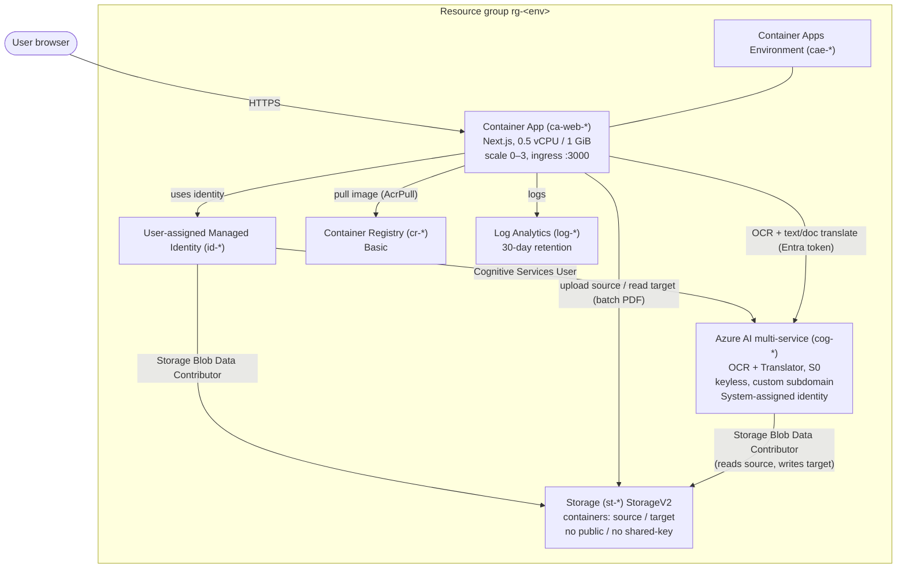

# Azure Infrastructure

Everything below is provisioned by [`azd up`](../README.md#deploy-to-azure-with-azd) from the Bicep in
[`infra/`](../infra) ([`main.bicep`](../infra/main.bicep) → [`resources.bicep`](../infra/resources.bicep)).
A single command creates a new resource group `rg-<env>` with all required resources, wires least-privilege
RBAC, builds and pushes the container image, and deploys the app. The deployment is **keyless end to end** —
no secrets are stored anywhere.

**Live deployment:** once deployed, your app is reachable at the Container App
FQDN that `azd up` prints (`azd env get-value WEB_BASE_URL`).

---

## Architecture



---

## Components

| Resource | Type / SKU | Purpose |
| -------- | ---------- | ------- |
| **Container App** `ca-web-*` | `Microsoft.App/containerApps` — 0.5 vCPU / 1.0 GiB, scale **0–3**, external ingress on port 3000 | Hosts the Next.js app (standalone Docker image). Uses the user-assigned identity for all Azure calls. |
| **Container Apps Environment** `cae-*` | `Microsoft.App/managedEnvironments` | Runtime/networking boundary for the app; ships container logs to Log Analytics. |
| **User-assigned Managed Identity** `id-*` | `Microsoft.ManagedIdentity` | Keyless identity the app authenticates with (`AZURE_CLIENT_ID`). Holds all data-plane roles. |
| **Azure AI multi-service** `cog-*` | `Microsoft.CognitiveServices/accounts`, kind `CognitiveServices`, **S0** | OCR (Document Intelligence `prebuilt-read`) **and** Translator (Text + Document Translation). Custom subdomain + **`disableLocalAuth = true`** (Entra-only). System-assigned identity so the Translator can read/write blobs for batch PDF jobs. |
| **Storage account** `st-*` | `Microsoft.Storage`, StorageV2, **Standard_LRS** | `source` / `target` blob containers for layout-preserving (batch) PDF translation. Public blob access **off**, shared-key access **off** (OAuth only), TLS 1.2 min. Lifecycle rule **auto-deletes working blobs after 1 day**. |
| **Container Registry** `cr-*` | `Microsoft.ContainerRegistry`, **Basic** | Stores the app's Docker image. Admin user disabled; pulled via the app identity (`AcrPull`). |
| **Log Analytics workspace** `log-*` | `Microsoft.OperationalInsights`, PerGB2018, 30-day retention | Centralized container logs/observability. |

---

## Identity & access (RBAC)

All access is via Microsoft Entra ID — **no keys, no SAS, no connection strings**.

| Principal | Role | Scope | Why |
| --------- | ---- | ----- | --- |
| App identity (`id-*`) | **Cognitive Services User** | AI account | Call OCR + translation data plane |
| App identity (`id-*`) | **Storage Blob Data Contributor** | Storage | Upload source PDF / download translated PDF |
| App identity (`id-*`) | **AcrPull** | Container Registry | Pull the app image |
| AI account system identity (`cog-*`) | **Storage Blob Data Contributor** | Storage | Batch Document Translation reads `source`, writes `target` |
| Developer (azd `principalId`, optional) | Cognitive Services User + Storage Blob Data Contributor | AI + Storage | Run/evaluate the app locally with `az login` |

---

## App configuration (set on the Container App)

Injected as environment variables by Bicep — all non-secret:

`AZURE_CLIENT_ID`, `AZURE_DOCUMENT_INTELLIGENCE_ENDPOINT`, `AZURE_DOCUMENT_TRANSLATION_ENDPOINT`,
`AZURE_TRANSLATOR_REGION`, `AZURE_TRANSLATOR_RESOURCE_ID`, `AZURE_STORAGE_ACCOUNT_NAME`,
`AZURE_STORAGE_BLOB_ENDPOINT`, `AZURE_STORAGE_SOURCE_CONTAINER`, `AZURE_STORAGE_TARGET_CONTAINER`.

---

## Security posture

- **Keyless / passwordless:** local-auth disabled on the AI account; shared-key disabled on storage. Auth is exclusively Entra ID tokens via managed identity (in Azure) or `az login` (locally).
- **Least privilege:** each identity gets only the roles it needs, scoped to the specific resource.
- **No data retention:** uploaded files are processed in memory; batch working blobs are deleted right after each job and again by a 1-day lifecycle rule as a safety net.
- **Private by default:** storage blocks public blob access; the registry has no admin user; only the Container App is publicly reachable (HTTPS).

---

## Standing (fixed) monthly cost

Per-use AI costs are in [EVALUATION.md](EVALUATION.md). The hosting footprint is intentionally cheap and mostly consumption-based (region `southeastasia`, retail USD, 2026-06-22):

| Resource | Pricing model | Idle / light-use estimate |
| -------- | ------------- | ------------------------- |
| Container Registry (Basic) | **$0.167 / day** flat | **~$5 / month** (the only real fixed cost) |
| Container Apps | Consumption; **scales to zero**. Free monthly grant: 180k vCPU-s, 360k GiB-s, 2M requests | **~$0** when idle; cents under light traffic |
| Log Analytics | ~$0.13 /GB-month retention, ~$2.30 /GB analyzed | **~$0–2 / month** at low log volume |
| Storage (Standard_LRS Hot) | $0.02 /GB-month + tiny op costs; blobs deleted after 1 day | **a few cents / month** |
| Azure AI multi-service (S0) | Pay-per-use only — **no standing charge** | $0 at rest (see EVALUATION.md for per-document cost) |
| Managed Identity, Container Apps Environment | No charge | $0 |

**Estimated fixed cost ≈ $5/month idle (~$5–10/month under light use), dominated by ACR Basic**, plus the
variable per-document AI charges when documents are actually translated.

> Tip: if you don't need a private image registry between deploys, ACR Basic is the main thing to remove to
> approach ~$0 standing cost. `azd down` deletes the whole resource group.

---

## Provision / tear down

```powershell
azd auth login
azd up        # create RG + all resources, build image, deploy app, print URL
# ...
azd down      # delete everything
```
