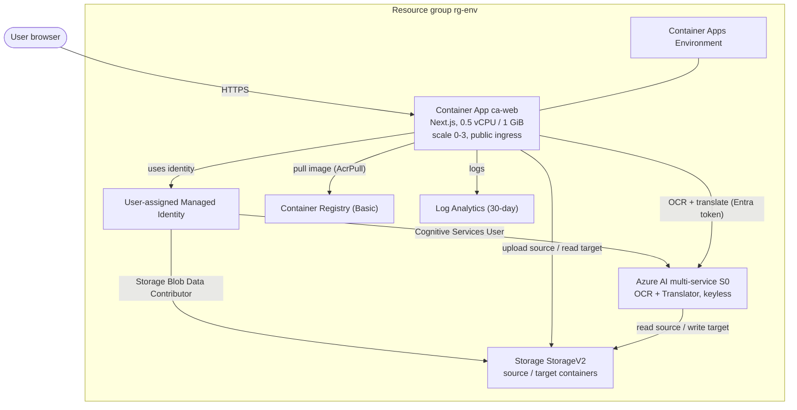
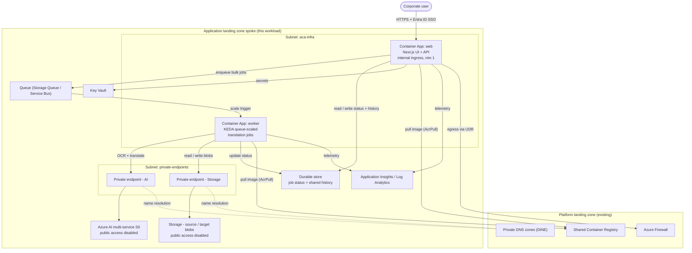

# Azure Document Translator - What's Next: From Demo to Production

| | |
| --- | --- |
| **Document type** | Solution proposal / production-readiness plan |
| **Prepared for** | Client / partner evaluation |
| **Status** | Draft for review |
| **Date** | 2026-07-08 |
| **Region basis** | Azure Southeast Asia, retail USD (pay-as-you-go) |
| **Related docs** | [INFRASTRUCTURE.md](INFRASTRUCTURE.md), [EVALUATION.md](EVALUATION.md), [README.md](../README.md) |

---

## Table of contents

1. [Executive summary](#1-executive-summary)
2. [What has been built today](#2-what-has-been-built-today)
   - 2.1 [Solution overview](#21-solution-overview)
   - 2.2 [Feature inventory](#22-feature-inventory)
   - 2.3 [Current architecture (AI, apps, networking, security, data)](#23-current-architecture)
   - 2.4 [Bill of Materials - current architecture](#24-bill-of-materials---current-architecture)
   - 2.5 [Current limitations (demo-grade gaps)](#25-current-limitations-demo-grade-gaps)
3. [What's next - production-grade on an Azure Landing Zone](#3-whats-next---production-grade-on-an-azure-landing-zone)
   - 3.1 [Target operating model](#31-target-operating-model)
   - 3.2 [Proposed architecture](#32-proposed-architecture)
   - 3.3 [Requirements to finalize with client / partner](#33-requirements-to-finalize-with-client--partner)
   - 3.4 [Production Bill of Materials and pricing](#34-production-bill-of-materials-and-pricing)
4. [Actionable next steps](#4-actionable-next-steps)
   - 4.1 [Decision: build it yourself or engage a partner](#41-decision-build-it-yourself-or-engage-a-partner)
   - 4.2 [Option A - Client-led (DIY): what to prepare](#42-option-a---client-led-diy-what-to-prepare)
   - 4.3 [Option B - Partner-led: selection and engagement](#43-option-b---partner-led-selection-and-engagement)
   - 4.4 [Budget-tiered options](#44-budget-tiered-options)
   - 4.5 [Phased delivery roadmap](#45-phased-delivery-roadmap)
   - 4.6 [Risks and assumptions](#46-risks-and-assumptions)
5. [Appendix](#5-appendix)

---

## 1. Executive summary

The Azure Document Translator is a working web application that lets a user upload a
document (PDF, Word, PowerPoint, Excel, HTML, or image) and translate it with Azure AI,
then review the original and translated versions side by side. It offers two modes -
**Text view** (OCR then translate the extracted text) and **Preserve layout** (translate
the whole file while keeping tables, formatting, and even text baked into charts and
images). It is deployed today as a **single-tenant demo** on Azure Container Apps, is
**keyless end to end** (Microsoft Entra ID managed identity, no secrets), and costs
approximately **USD 6 per month** at rest.

The demo has proven the core value: measured translation coverage is **~100 percent** on a
real Japanese government document corpus, at roughly **USD 0.17-0.30 per typical document**
(see [EVALUATION.md](EVALUATION.md)). What it is **not** yet is an enterprise service:
sign-in is a shared username and password rather than corporate SSO, history lives in the
browser rather than a shared store, the app is on the public internet rather than inside a
private network, and the upload experience is one file at a time rather than bulk.

This document describes:

- **Section 2** - exactly what has been built, the architecture across AI / apps /
  networking / security / data, and a Bill of Materials for the current deployment.
- **Section 3** - a production-grade target that runs as an **application landing zone
  spoke** inside the client's existing Azure Landing Zone, the requirements the client and
  partner must finalize (user experience, authentication, bulk-upload scale, error handling,
  latency), and a production Bill of Materials with volumetric pricing at 100 / 1,000 /
  10,000 documents per month.
- **Section 4** - the decision and the concrete next steps, whether the client builds it
  themselves (and what to prepare) or engages a partner (selection criteria, engagement
  model, and budget-tiered options).

---

## 2. What has been built today

### 2.1 Solution overview

A Next.js 15 web application (React 18, TypeScript, Tailwind) running as a container on
Azure Container Apps. The user uploads a document; the app calls Azure AI services to
extract and translate text, then presents a before / after comparison. There is no database
and no long-term storage - files are processed in memory and any working blobs used for
large-PDF translation are deleted immediately and again by a 1-day lifecycle rule.

| Mode | What it does | Azure service |
| --- | --- | --- |
| **Text view** | Runs OCR to extract text, translates it, shows before / after **text** | Document Intelligence (`prebuilt-read`) + Translator (Text v3.0) |
| **Preserve layout** | Translates the whole file **keeping tables, formatting, and layout**; for images, renders the translation back onto the picture | Translator Document Translation (sync + async batch) + Document Intelligence for PDF |

**Live deployment:** `azd up` provisions the environment and prints the Container
App URL (also available via `azd env get-value WEB_BASE_URL`).

### 2.2 Feature inventory

Everything below is implemented, deployed, and verified against the live Azure resources.

| # | Feature | Description |
| --- | --- | --- |
| 1 | **Text-view translation** | OCR (`prebuilt-read`) then Translator Text v3.0; side-by-side text with automatic source-language detection and 30+ target languages. |
| 2 | **Preserve-layout translation** | Translator Document Translation keeps tables and formatting for DOCX / PPTX / XLSX / HTML and, for images, renders the translated text back in place. |
| 3 | **Large-PDF async pipeline** | PDFs over ~8 pages or ~15 MB are split into 3-page chunks, translated as parallel batch jobs, then merged - keeping big documents within request-time limits. Job state is a **stateless HMAC-signed token**, so it survives container scaling with no server-side session store. |
| 4 | **Image-text translation toggle** | Optional `translateTextWithinImage` to translate text baked into charts and screenshots (best-effort OCR by the Azure service). |
| 5 | **Sign-in gate** | Username / password with an HMAC-signed, httpOnly session cookie enforced in Edge middleware and API routes. |
| 6 | **PDF compare overlay** | Full-screen, synchronized before / after PDF rendering (pdf.js) with zoom. |
| 7 | **Processing history** | Per-browser IndexedDB store of recent translations with re-downloadable source and translated files. |
| 8 | **Per-translation evaluation report** | Optional characters / estimated cost / processing-time report per run. |
| 9 | **Server-side telemetry** | Structured one-line JSON logs (started / completed / failed, mode, characters, cost, duration) to Log Analytics for fleet-wide troubleshooting. |
| 10 | **Monitoring dashboard** | A script that renders an interactive HTML dashboard (completed vs failed, characters, cost, latency) from the telemetry in Log Analytics. |
| 11 | **Keyless auth** | All Azure calls use Microsoft Entra ID via managed identity - no keys, SAS, or connection strings anywhere. |

### 2.3 Current architecture

The current design is a self-contained, publicly reachable deployment. All Azure access is
via Microsoft Entra ID; there are no secrets. The five architecture lenses:

**AI.** A single **Azure AI multi-service (Cognitive Services) S0** account provides both
**Document Intelligence** (OCR, `prebuilt-read`) and **Translator** (Text v3.0 and Document
Translation, sync and async batch). Local key auth is disabled (`disableLocalAuth = true`);
a custom subdomain enables Entra ID auth and the Document Translation endpoint. The account
has a system-assigned identity so the Translator can read and write blobs during batch jobs.

**Application.** A **Next.js standalone container** on **Azure Container Apps** (0.5 vCPU /
1.0 GiB, scale 0-3, external ingress on port 3000). The app authenticates to Azure with a
**user-assigned managed identity**. The image is stored in a **Basic Azure Container
Registry** and pulled with `AcrPull`.

**Networking.** Public HTTPS ingress directly to the Container App. There is no virtual
network, no private endpoints, and no egress control - the app reaches Azure AI and Storage
over their public endpoints (guarded by Entra ID and RBAC).

**Security.** Keyless / passwordless throughout (Entra ID tokens via managed identity, or
`az login` locally). Least-privilege RBAC: the app identity holds only Cognitive Services
User (AI), Storage Blob Data Contributor (Storage), and AcrPull (registry). Storage blocks
public blob access and shared-key access (OAuth only, TLS 1.2). A username / password gate
protects the UI.

**Data.** No database. Files are processed in memory. Layout-preserving PDF translation
stages working files in `source` / `target` blob containers that are deleted right after
each job and by a 1-day lifecycle rule. User-visible history is **client-side only**
(IndexedDB, per browser).

### 2.4 Bill of Materials - current architecture

Standing (fixed) monthly cost of the hosting footprint, region `southeastasia`, retail USD.
Per-use AI charges are separate and covered in [Section 3.4](#34-production-bill-of-materials-and-pricing).

| Resource | Type / SKU | Pricing model | Idle / light-use estimate |
| --- | --- | --- | --- |
| Container Registry | `Microsoft.ContainerRegistry` - Basic | ~USD 0.167 / day flat | **~USD 5 / month** (the only real fixed cost) |
| Container Apps (web) | `Microsoft.App/containerApps` - 0.5 vCPU / 1 GiB, scale 0-3 | Consumption, scales to zero; free monthly grant 180k vCPU-s, 360k GiB-s, 2M requests | **~USD 0** idle; cents under light traffic |
| Container Apps Environment | `Microsoft.App/managedEnvironments` | No base charge (Consumption) | USD 0 |
| Log Analytics | `Microsoft.OperationalInsights` - PerGB2018, 30-day | ~USD 2.99 / GB ingest, ~USD 0.13 / GB-month retention | **~USD 0-2 / month** at low log volume |
| Storage | `Microsoft.Storage` - StorageV2, Standard_LRS Hot | USD 0.02 / GB-month + tiny op cost; blobs deleted after 1 day | **a few cents / month** |
| Azure AI multi-service | `Microsoft.CognitiveServices` - S0 | Pay-per-use only, no standing charge | **USD 0** at rest (see 3.4) |
| Managed Identity | `Microsoft.ManagedIdentity` | No charge | USD 0 |

> **Current standing cost: ~USD 6 / month** (dominated by ACR Basic), plus variable
> per-document AI charges when documents are translated.

### 2.5 Current limitations (demo-grade gaps)

These are the reasons the current build is a demo and not yet an enterprise service. Each
maps to a production requirement in [Section 3.3](#33-requirements-to-finalize-with-client--partner).

| Area | Today (demo) | Why it matters for production |
| --- | --- | --- |
| **Authentication** | Shared username / password gate | No per-user identity, SSO, MFA, RBAC, or audit trail |
| **Multi-user data** | History in the browser (IndexedDB) | Not shared across users or devices; no central record of what was translated |
| **Networking** | Public ingress; AI + Storage on public endpoints | Not private; does not meet enterprise network isolation baselines |
| **Storage reachability** | Storage public network access toggled on | Repeatedly disabled by org policy, breaking layout-PDF until manually re-enabled - a private endpoint fixes this permanently |
| **Bulk upload** | One file at a time, synchronous | Cannot ingest a folder or hundreds of files; the browser waits on each job |
| **Throughput / scale** | Single web container does the work | No queue, no worker pool, no autoscale on backlog |
| **Error handling** | Per-request try / catch | No retry with backoff, dead-letter, or partial-batch reporting for bulk jobs |
| **File size** | ~30 MB cap | Enterprise documents can exceed this; needs a tuned limit and chunking policy |
| **Latency** | Best-effort; image-text mode is slow | Needs default tuning (born-digital vs scanned) and co-location guarantees |
| **Observability** | Logs + optional dashboard script | No alerting, SLOs, or integrated dashboards / workbooks |

---

## 3. What's next - production-grade on an Azure Landing Zone

### 3.1 Target operating model

The production target is an **application landing zone spoke** that plugs into the client's
**existing Azure Landing Zone (ALZ) platform**. We assume the platform team already provides
the shared foundation - hub network, **Azure Firewall**, **Private DNS zones**, connectivity
(ExpressRoute / VPN), policy (Azure Policy / DINE), and a **shared container registry**.
This application landing zone owns only the workload: the app, its AI and storage
resources, its private endpoints, and its identity.

Key design decisions (carried over from prior analysis and confirmed for this proposal):

- **Create a spoke virtual network** with two subnets (Container Apps infrastructure,
  private endpoints), peered to the platform hub.
- **Internal-only ingress** via an internal load balancer (`internal: true`) - no public
  endpoint. Reachable from the corporate network. This also **avoids the Container Apps
  Dedicated Plan management fee (~USD 73 / month)** that a workload-profile or
  environment-level private endpoint would incur; the Consumption profile still scales to
  zero.
- **Platform-hosted Private DNS** (DINE policy resolves `privatelink.cognitiveservices.azure.com`
  and `privatelink.blob.core.windows.net`); the app creates the private endpoints only.
- **Reuse the shared platform container registry** (the app identity gets `AcrPull`), so the
  app does not pay for a Premium registry just to get a private endpoint.
- **Force-tunnel egress** through the platform hub firewall via a user-defined route.
- **Disable public network access** on the AI account and Storage - permanently fixing the
  recurring "storage public access disabled by policy" problem the demo hit.

### 3.2 Proposed architecture

The workload adds three capabilities on top of the demo: **enterprise identity (Entra ID
SSO)**, **bulk asynchronous processing (queue + worker)**, and **shared durable state**
(job status and history), all inside a **private network**.

**What changes versus today:**

| Capability | Today | Production |
| --- | --- | --- |
| Identity | Username / password gate | **Microsoft Entra ID SSO** (Container Apps built-in auth / Easy Auth), groups + RBAC, MFA via Conditional Access |
| Networking | Public ingress, public AI / Storage | **Private** spoke VNet, internal ingress, **private endpoints** for AI + Storage, egress via hub firewall |
| Processing | Web container does the work synchronously | **Queue + KEDA-scaled worker** container; the UI submits and tracks progress |
| State | Per-browser IndexedDB | **Shared durable store** (Azure Table Storage or Cosmos DB serverless) for job status + history |
| Registry | Own Basic ACR | **Reuse shared platform ACR** (AcrPull) |
| Secrets | Container App secrets | **Key Vault** (with managed identity) |
| Observability | Logs + script dashboard | **Application Insights**, workbooks, alerts, SLOs |
| Availability | Scale to zero | **Min 1 replica** (warm), optional zone redundancy / multi-region (Phase 3) |

### 3.3 Requirements to finalize with client / partner

These are the decisions and detailed requirements to lock down before build. They are the
substance of a short discovery / design engagement.

**User experience (UX)**
- Bulk, multi-file upload (drag a folder or many files), with per-file progress and an
  overall batch status.
- Notifications on completion (in-app, and optionally email / Teams for long batches).
- "Download all" as a zip; re-download of individual results.
- Language selection defaults, glossary selection, and per-batch options (image-text on/off).
- Accessibility (WCAG) and localization of the UI itself if required.

**Authentication and authorization**
- Microsoft Entra ID SSO (single or multi-tenant), enforced at ingress (Container Apps
  Easy Auth) - replacing the username / password gate.
- Role model: who can translate, who can see whose history, who administers glossaries.
- Conditional Access / MFA alignment with the client's baseline; audit logging of access
  and actions.

**Scale and bulk upload**
- Decouple submission from processing with a **queue**; a **worker** pool autoscaled by
  queue depth (KEDA). Target throughput (documents / hour) and maximum batch size to be
  agreed.
- Per-user and per-tenant concurrency limits and fair-sharing.
- Azure AI Translator throughput quotas (characters / hour) sized to peak; commitment tiers
  considered at high volume.

**Error handling and resilience**
- Retry with exponential backoff on transient failures; **dead-letter** for poison
  messages; idempotency keys so re-submits do not double-charge.
- Partial-batch success: a 200-file batch reports 197 succeeded / 3 failed with reasons,
  and lets the user retry only the failures. (Per-chunk isolation already exists in the
  large-PDF pipeline and generalizes here.)
- Clear, actionable user messaging for unsupported formats, oversized files, and service
  throttling.

**Latency optimization**
- Default **image-text OFF** for born-digital documents (measured ~8.7x faster and cheaper),
  ON only for scanned / chart-heavy documents - ideally auto-selected by a
  born-digital-vs-scanned classifier.
- Keep compute **co-located** with the AI and Storage resources (same region) so blob
  download and OCR are intra-region (the demo's slow cross-region downloads were a
  local-dev artifact, not a production one).
- Cache OCR output so re-translating the same document to additional languages does not
  re-run (or re-pay for) OCR.
- Tune chunk size and parallelism against the agreed document profile.

**Data handling and compliance**
- Data residency (keep processing in-region), retention policy for inputs / outputs (the
  demo deletes within 1 day - confirm the enterprise policy), and PII handling.
- Custom glossary / terminology management for domain-consistent translations.
- Encryption (platform-managed vs customer-managed keys), and whether any content must
  never leave a boundary.

**Observability and operations**
- Application Insights with dashboards / workbooks for volume, success rate, cost, and
  latency; alerts on failure-rate and latency SLO breaches.
- Defined SLOs (for example, 99 percent of single documents complete within N minutes) and
  an on-call / support model.
- CI/CD pipeline (GitHub Actions or Azure DevOps), infrastructure-as-code, and
  dev / test / prod environments.

### 3.4 Production Bill of Materials and pricing

#### Assumptions

> - Region **Southeast Asia**, retail **USD**, pay-as-you-go (same basis as [EVALUATION.md](EVALUATION.md)).
> - **Representative document = ~2 MB, ~15 pages, ~15,000 source characters** (the measured
>   density of the evaluation corpus is ~1,000 characters / page). Real documents vary; use
>   this as the modeling anchor.
> - **One target language** per document. Extra languages multiply only the translation
>   characters (OCR is paid once if cached).
> - Platform-shared services (**hub firewall, Private DNS, shared ACR, connectivity**) are
>   **billed to the platform landing zone**, not to this workload, per Section 3.1.
> - Prices are indicative and move over time; confirm with the Azure Pricing Calculator or
>   the Retail Prices API at build time.

**Unit prices used** (from [EVALUATION.md](EVALUATION.md), `southeastasia`):

| Service and meter | Unit | Price |
| --- | --- | ---: |
| Document Intelligence - Read (S0) | per 1,000 pages | USD 1.50 |
| Translator - Text translation (S1) | per 1,000,000 characters | USD 10.00 |
| Translator - Document Translation (S1) | per 1,000,000 characters | USD 15.00 |
| Translator - Image translation (S1) | per 1,000 images | USD 8.00 |
| Private Endpoint | per endpoint-hour | USD 0.01 (~USD 7.30 / month) |
| Container Apps - vCPU (idle) | per vCPU-second | USD 0.000004 |
| Container Apps - memory | per GiB-second | USD 0.000004 |
| Container Apps - free grant | per subscription / month | 180k vCPU-s, 360k GiB-s, 2M requests |

#### Fixed infrastructure BOM (production spoke)

Monthly cost the **application** subscription pays (platform-shared items excluded).

| Resource | SKU / config | Pricing model | Monthly estimate |
| --- | --- | --- | ---: |
| Private endpoint - AI | 1 endpoint | ~USD 7.30 / endpoint | **~USD 7.30** |
| Private endpoint - Storage (blob) | 1 endpoint | ~USD 7.30 / endpoint | **~USD 7.30** |
| Container App - web | 0.5 vCPU / 1 GiB, **min 1 (warm)** | Consumption, less free grant | **~USD 13-15** |
| Container App - worker | 0.5 vCPU / 1 GiB, KEDA scale-to-zero | Consumption, mostly free grant at low volume | **~USD 0-10** (volume-driven) |
| Durable store | Table Storage or Cosmos DB serverless | Table ~pennies; Cosmos serverless RU-based | **~USD 1-5** |
| Key Vault | Standard | per-operation | **~USD 0-3** |
| Storage (blobs) | Standard_LRS Hot, 1-day lifecycle | USD 0.02 / GB-month + ops | **~USD 1** |
| Application Insights / Log Analytics | PerGB2018 | ~USD 2.99 / GB ingest | **~USD 2-5** |
| Azure AI multi-service | S0 | no standing charge | **USD 0** |
| Spoke VNet, managed identity, ACA environment | - | no base charge | **USD 0** |
| Container Registry | **shared platform ACR (AcrPull)** | billed to platform | **USD 0** (to this workload) |

> **Fixed production infrastructure: ~USD 30-50 / month** (typical ~USD 35), internal and
> warm. Retaining scale-to-zero on the web app (accepting cold starts) drops this to
> **~USD 18 / month**. Platform-shared firewall / DNS / ACR are not charged here.

If the app must **also be exposed to the public internet or external partners**, add
**Azure Front Door Standard + WAF (~USD 35+ / month)** as an option - not required for an
internal-only ALZ spoke.

#### Per-document AI cost model

Based on the ~2 MB / ~15-page / ~15,000-character representative document:

| Path | Calculation | Per-document cost |
| --- | --- | ---: |
| **Text view** | OCR 15 pages x USD 1.50/1k + 15,000 chars x USD 10/1M | **~USD 0.17** |
| **Preserve layout (image OFF)** | 15,000 chars x USD 15/1M | **~USD 0.225** |
| **Preserve layout (image ON)** | ~19,500 chars x USD 15/1M (image text adds characters) | **~USD 0.30** (varies with image content) |

Measured rules of thumb (from [EVALUATION.md](EVALUATION.md)): Text view **~USD 9.60 /
1,000 pages**; Preserve layout **~USD 12 / 1,000 pages** image off, **~USD 18 / 1,000 pages**
image on.

#### Volumetric total cost of ownership

Fixed infrastructure (~USD 35 / month typical) plus variable AI cost. Two representative
processing profiles shown.

**Variable AI cost per month**

| Documents / month | Text view (~USD 0.17 ea) | Layout image-off (~USD 0.225 ea) | Layout image-on (~USD 0.30 ea) |
| ---: | ---: | ---: | ---: |
| 100 | ~USD 17 | ~USD 23 | ~USD 30 |
| 1,000 | ~USD 173 | ~USD 225 | ~USD 293 |
| 10,000 | ~USD 1,725 | ~USD 2,250 | ~USD 2,925 |

**Total cost of ownership (fixed ~USD 35 + variable)**

| Documents / month | TCO - Text view | TCO - Layout image-off | TCO - Layout image-on |
| ---: | ---: | ---: | ---: |
| 100 | **~USD 52** | **~USD 58** | **~USD 65** |
| 1,000 | **~USD 208** | **~USD 260** | **~USD 328** |
| 10,000 | **~USD 1,760** | **~USD 2,285** | **~USD 2,960** |

> **Cost is dominated by the AI translation meter, which scales linearly with characters.**
> Infrastructure is effectively fixed. At 10,000 documents / month the per-document AI
> charge is ~98 percent of the bill.

#### Cost optimization levers

- **Default image-text OFF** for born-digital documents - lower character charges, ~8.7x
  faster, smaller output; enable ON only for scanned / chart-heavy files.
- **Cache OCR** so multi-language translation of the same document does not re-pay OCR.
- **Translator commitment tiers** (Document Translation) reduce per-character cost at
  sustained high volume - evaluate at ~10,000+ documents / month.
- **Keep scale-to-zero** on non-critical paths; accept cold start to save the warm-replica cost.
- **Right-size logging** (sampling in Application Insights) to control ingestion cost.
- **Azure savings plan / reservations** for any always-on compute at steady state.

---

## 4. Actionable next steps

### 4.1 Decision: build it yourself or engage a partner

The core application already exists and is proven. The remaining work is **productionization**:
private networking in the landing zone, enterprise SSO, bulk / async processing, shared
state, and operational readiness. The client should decide whether to deliver this with
**internal teams (DIY)** or with a **partner**, informed by in-house Azure landing-zone and
Container Apps capability, timeline, and budget (Section 4.4).

### 4.2 Option A - Client-led (DIY): what to prepare

If the client builds this in-house, the platform and app teams should prepare the following
**before** development starts:

**Landing zone and networking**
- An **application landing zone subscription / resource group** vended from the ALZ.
- **Non-overlapping CIDR** ranges for the spoke VNet and its two subnets, agreed with the
  platform team; hub peering and the egress UDR to the hub firewall.
- **Private DNS** for `privatelink.cognitiveservices.azure.com` and
  `privatelink.blob.core.windows.net` - either the platform's DINE policy auto-registers the
  private endpoints, or the zones are delegated to the app team.
- Any **security-baseline exceptions** needed (for example confirming internal ingress and
  private endpoints satisfy the network policy so storage public access stays disabled).

**Identity and access**
- An **Entra ID app registration / enterprise application** for SSO, with group-to-role
  mapping and Conditional Access alignment.
- **RBAC rights** to create role assignments for the managed identity (Cognitive Services
  User, Storage Blob Data Contributor, AcrPull on the shared registry).
- Deployer access to the **shared platform ACR** (`AcrPush` for the pipeline, `AcrPull` for
  the app identity).

**Capacity and content**
- **Azure AI / Translator quota** (characters per hour) sized to peak, and region capacity
  confirmed; commitment-tier decision if high volume.
- A **representative document corpus** and a **custom glossary** for quality tuning and
  acceptance testing.

**Delivery**
- **CI/CD** (GitHub Actions or Azure DevOps), infrastructure-as-code review, and
  dev / test / prod environments.
- **Budget approval** for the fixed infrastructure and the expected per-volume AI spend
  (Section 3.4).

### 4.3 Option B - Partner-led: selection and engagement

If the client prefers a partner, use the model below.

**Engagement model** (typical phases)
1. **Discovery and design** - finalize the Section 3.3 requirements, landing-zone design,
   security review, and acceptance criteria.
2. **Build** - infrastructure-as-code for the spoke, SSO, queue / worker, durable state,
   CI/CD.
3. **Hardening** - security testing, load / soak testing, DR, runbooks.
4. **Hypercare and managed run** - post-go-live support and optional ongoing operations.

### 4.4 Phased delivery roadmap

| Phase | Outcome | Key work |
| --- | --- | --- |
| **0. Hardening and readiness** | Demo is production-hygiene clean | Confirm requirements (3.3), pin dependencies, finalize file-size and retention policy, baseline tests |
| **1. Landing zone + private networking + SSO** | App runs privately in the ALZ spoke with corporate SSO | Spoke VNet + subnets, internal ingress, private endpoints (AI + Storage), disable public access, Entra ID SSO, shared-ACR AcrPull |
| **2. Bulk upload + async processing + shared state** | Users submit many files; work is queued and tracked centrally | Multi-file UX, queue + KEDA worker, durable job / history store, partial-batch reporting |
| **3. Scale, observability, and resilience** | Meets SLOs with alerting and DR | Autoscale tuning, Application Insights dashboards / alerts, SLOs, zone / multi-region as required, load and DR testing |
| **4. Quality and cost optimization** | Best accuracy per dollar | Born-digital-vs-scanned auto-selection, OCR caching, glossary management, commitment-tier / savings-plan review |

### 4.5 Risks and assumptions

**Assumptions**
- The client has an existing ALZ platform that provides hub firewall, Private DNS, shared
  ACR, and connectivity (Section 3.1). If not, a greenfield foundation adds cost and effort
  (hub, firewall, DNS, connectivity) - a separate workstream.
- Documents match the modeling profile (~2 MB, ~15 pages); materially larger or denser
  documents change AI cost and latency proportionally.
- Southeast Asia region and retail USD pricing; a different region or an Enterprise Agreement
  changes the numbers.

**Risks and mitigations**
- **Image-text translation is best-effort** for scanned charts (an Azure service
  characteristic) - mitigate with Text view for reading and by translating born-digital
  source where available.
- **Very large / dense PDFs** are slow even when split - mitigate with the async pipeline,
  clear progress UX, and image-text OFF by default.
- **AI quota / throttling** at high volume - mitigate by sizing quota to peak and evaluating
  commitment tiers.
- **Policy drift** (for example storage public access) - mitigate permanently by moving to
  private endpoints in Phase 1.

---

## 5. Appendix

**References**
- [INFRASTRUCTURE.md](INFRASTRUCTURE.md) - current architecture, RBAC, and standing cost.
- [EVALUATION.md](EVALUATION.md) - translation accuracy and per-document / per-1,000-page cost.
- [README.md](../README.md) - features, modes, and how it works.
- Azure pricing should be confirmed at build time via the Azure Pricing Calculator or the
  Azure Retail Prices API for the target region and agreement type.

**Glossary**
- **ALZ** - Azure Landing Zone. **Application landing zone** - a workload spoke that plugs
  into the platform. **DINE** - Deploy-If-Not-Exists Azure Policy. **KEDA** - Kubernetes
  Event-Driven Autoscaling (used by Container Apps to scale on queue depth). **ILB** -
  internal load balancer. **OCR** - optical character recognition. **SLO** - service-level
  objective. **WAF** - web application firewall.
